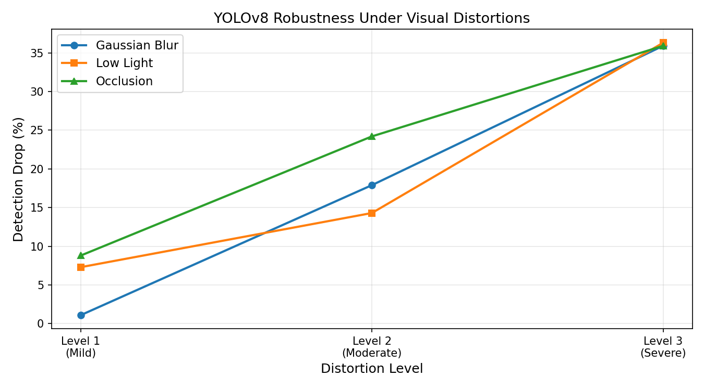

# Severity-Aware Road Incident Detection Pipeline

> A real-time road incident detection system that detects when its own camera is compromised and adjusts severity alerts accordingly.


## The Problem
Road accident response delays are a leading cause of fatality escalation. Existing surveillance systems fail under real-world visual conditions — low light, motion blur, and partial occlusion — and lack the ability to autonomously grade incident severity.

## The Solution
A unified pipeline that combines:
- **YOLOv8s** — real-time vehicle and pedestrian detection
- **Farneback Optical Flow** — per-object motion vector extraction
- **Wrong-Way Detection** — pre-crash risk flagging
- **Near-Miss Scoring** — dangerous proximity detection
- **LSTM Classifier** — temporal severity grading over 30-frame sequences
- **Distortion Compensation** — the novel contribution

## Novel Contribution
When camera degradation is detected (blur, low-light, occlusion), the system automatically adjusts its severity score upward and changes the alert action from `DISPATCH` to `VERIFY THEN DISPATCH`. No existing system does this.

## Live Dashboard
Built with Gradio — select any of 50 camera locations, click Analyse, watch the full pipeline run in real time.

## Results

| Metric | Value |
|--------|-------|
| Test Accuracy | 90.0% |
| Macro F1 | 0.90 |
| Critical Recall | **1.00** |
| Alert Confidence | 99.8% |
| Cameras Tested | 50 |
| Critical Locations | 23 / 50 |

## Robustness Benchmark

| Condition | Detection Drop |
|-----------|---------------|
| Blur L1 | 1.1% |
| Blur L3 | 35.9% |
| Low Light L1 | 7.3% |
| Low Light L3 | 36.3% |
| Occlusion L2 | 24.2% |
| Occlusion L3 | 35.9% |



## Pipeline Architecture
```
INPUT VIDEO STREAM
        ↓
Distortion Detection (Laplacian + Brightness)
        ↓
YOLOv8s Object Detection
        ↓
Farneback Optical Flow (per object)
        ↓
Wrong-Way Detection + Near-Miss Scoring
        ↓
Per-Frame Composite Anomaly Score
        ↓
LSTM Severity Classifier (30-frame sequences)
        ↓
Distortion-Compensated Alert Output
        ↓
Low / Medium / Critical + Confidence + Action
```

## Alert Output Example
```
SEVERITY : CRITICAL (99.8% confidence)
ACTION   : DISPATCH
Camera   : Clear | Compensation: +0%

SEVERITY : MEDIUM (92.9% confidence)
ACTION   : VERIFY THEN DISPATCH
Camera   : Blur  | Compensation: +10%
```

## Tech Stack

- Python 3.10
- YOLOv8s (Ultralytics)
- OpenCV (Farneback Optical Flow)
- PyTorch (LSTM Classifier)
- BDD100K Dataset (50 dashcam videos)
- Gradio (Live Dashboard)

## Project Structure
```
├── road_incident_detection.ipynb  
├── results/                       
├── models/                        
├── data/                          
└── demo/                          
```

## How To Run

1. Open `road_incident_detection.ipynb` in Google Colab
2. Run all cells sequentially
3. Gradio dashboard launches automatically at the end
4. Select any camera location from dropdown
5. Click Analyse Incident

## Dataset

- **BDD100K** — 50 dashcam videos (1280x720, 30fps)
- **Source:** Kaggle — deeplyft/driving-video-subset-50-with-object-tracking

## Key Design Decisions
 
| Decision                      | Reason                                     |
|-------------------------------|--------------------------------------------|
| YOLOv8s over nano             | Better accuracy, still real-time capable   |
| Farneback over Lucas-Kanade   | Dense flow — covers full bounding box      |
| LSTM over Transformer         | Small dataset — LSTM generalises better    |
| 30-frame sequences            | Captures full incident arc at 30fps        |
| Distortion compensation       | Novel — adjusts severity when camera fails |

## Performance

| Environment                | FPS     |
|----------------------------|---------|
| Colab T4 (shared)          | 2.8 fps |
| Dedicated GPU (projected)  | 25+ fps |
| With frame-skip mitigation | 8.4 fps |

